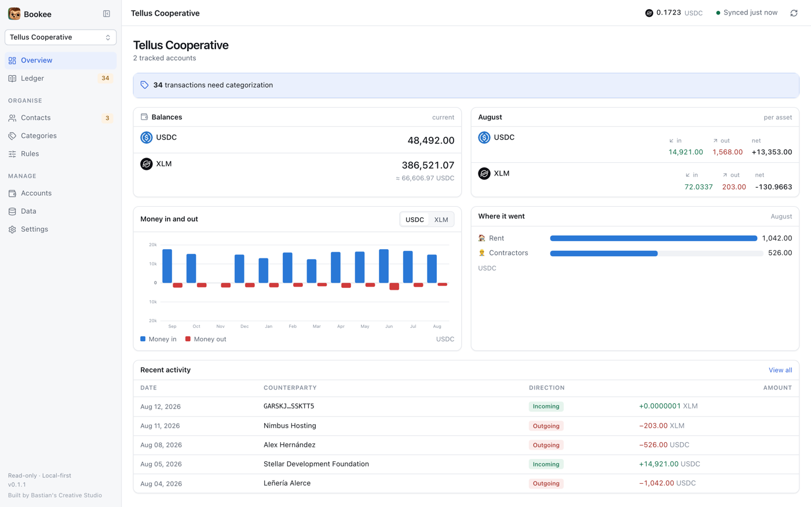
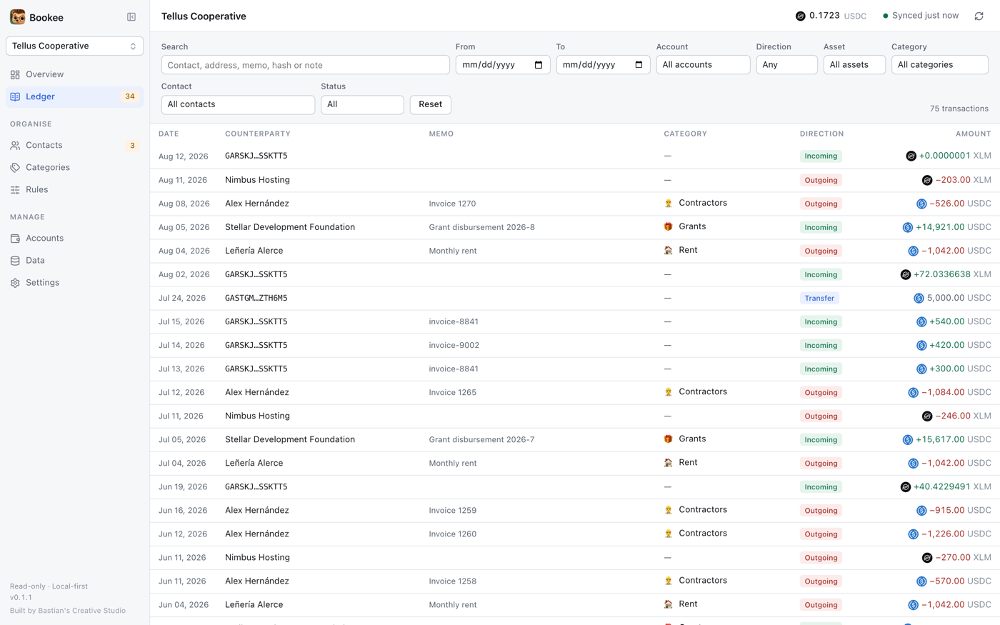
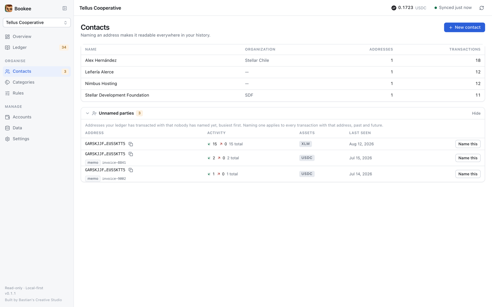
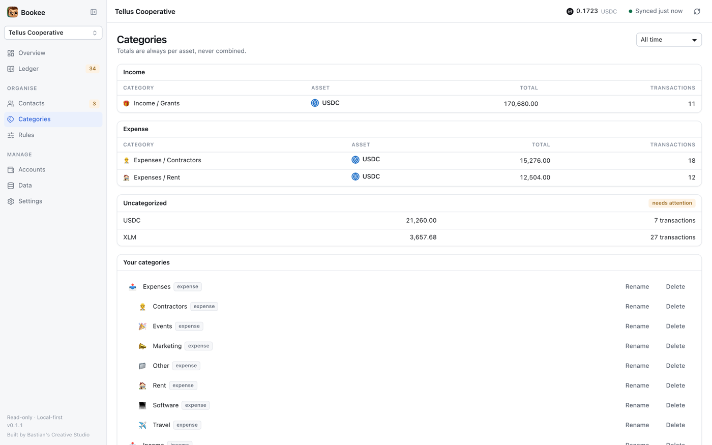
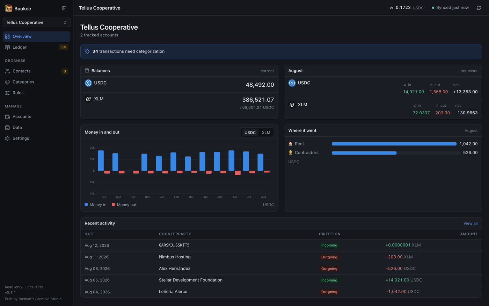

<div align="center">


# Bookee

**Stellar bookkeeping, on your machine.**

A local-first, read-only ledger that turns a Stellar account's on-chain history
into books you can actually read.

[](https://github.com/alexanderkoh/bookee/actions/workflows/ci.yml)
[](https://github.com/alexanderkoh/bookee/releases)
[](LICENSE)


**No wallet connection · No private keys · No backend · No telemetry**

</div>

---



## Why this exists

The Stellar network already records every payment you have ever made. What it
does not record is that `GD82…X22` is your landlord, that a transfer was between
two of your own wallets rather than an expense, or that a payment was for an
event and not a salary.

Bookee adds that missing layer — and keeps it on your machine.

```
PUBLIC STELLAR ADDRESS  →  BLOCKCHAIN HISTORY  →  HUMAN CONTEXT  →  UNDERSTANDABLE LEDGER
```

It is not a wallet. It never asks for a secret key, never signs anything, and
never submits a transaction. It cannot move your funds, because nothing in it
can.

## What it does

**Imports the full history** of any public address on public or testnet —
payments, path payments, account creation, merges, and Stellar Asset Contract
transfers, mints, burns and clawbacks.

**Gets the amounts exactly right.** Decimal arithmetic end to end. A 1-stroop
payment (`0.0000001`) and a six-figure balance are both stored byte-exact,
because a float round-trip corrupts one or the other.

**Recognises your own transfers.** Money moved between two accounts you track is
one internal transfer, not an expense plus an income.

**Names the people.** One address, one contact, resolved across all history at
once — and an address plus a memo can be its own contact, for shared deposit
addresses where the memo is the only thing telling payers apart.

**Classifies automatically.** Rules apply to past and future imports, and never
overwrite a choice you made by hand.

**Never invents a portfolio value.** Every balance, total, chart and export is
per-asset. 5 XLM plus 5 USDC is not 10 of anything.

<table>
<tr>
<td width="50%"></td>
<td width="50%"></td>
</tr>
<tr>
<td width="50%"></td>
<td width="50%"></td>
</tr>
</table>

<details>
<summary><b>Everything else it does</b></summary>

- **Dense ledger table** filtered by date, account, direction, asset, category,
  contact and free-text search — all pushed into SQL
- **Per-asset category summaries** and monthly reports
- **Charts** on the overview: money in and out per month, and where it went
- **Real asset icons** — XLM and USDC bundled, everything else read from the
  issuer's own `stellar.toml` (SEP-1)
- **Indicative rates** from the Stellar DEX order book, cached and timestamped,
  shown per asset and never summed into a total
- **Exports** — raw CSV with exact amounts, a QuickBooks Online bank CSV
  (3- or 4-column), and a monthly report
- **Portable `.bookee` backup** that survives a delete and reinstall
- **Diagnostics** listing anything the importer could not interpret, so nothing
  disappears silently
- **Multiple ledgers** for separate organisations, each fully independent
- **Keyboard-driven** throughout, with a visible focus ring, and direction never
  conveyed by colour alone

</details>

## Install

Download for your platform from
[Releases](https://github.com/alexanderkoh/bookee/releases):

| Platform | File | How |
| --- | --- | --- |
| macOS | `.dmg` | open it, drag Bookee to Applications |
| Windows | `.exe` or `.msi` | run the installer |
| Linux | `.AppImage` | `chmod +x` and run — no install needed |
| Linux | `.deb` / `.rpm` | `apt install ./…deb` or `dnf install ./…rpm` |

Then paste a public Stellar address. There is no account to create and nothing
to sign up for.

### "Unidentified developer"

Builds are **not code-signed** — signing certificates cost money this project
does not have — so macOS Gatekeeper and Windows SmartScreen will warn you. Take
that warning seriously in general: check the download came from the releases
page above, or build from source, which is the option this project can actually
vouch for.

**macOS** — right-click Bookee in Applications → Open → Open. Once only. Or:

```bash
xattr -dr com.apple.quarantine /Applications/Bookee.app
```

**Windows** — "More info" → "Run anyway".

## Build from source

```bash
git clone https://github.com/alexanderkoh/bookee.git
cd bookee
pnpm install
pnpm tauri dev
```

Needs Node 24+, pnpm 10+ and the Rust toolchain.

### See it without building

```bash
pnpm dev:preview     # the whole app on SQLite-WASM, seeded, at :5273
```

The preview runs the real application — real repositories, real SQL, real
components — against a deterministic seed, with no native build and no network.
The same `SqlDriver` seam that makes the database swappable for tests makes it
swappable for the browser.

Full notes in [docs/DEVELOPMENT.md](docs/DEVELOPMENT.md).

## How it is built

```
Stellar → Horizon → Zod → parsers → normalized entries → SQLite → repositories → UI
```

Tauri 2, React 19, TypeScript, Vite, SQLite, TanStack Router and Query, Zod,
big.js.

The organising principle is a split between **blockchain data** — immutable, and
always re-fetchable — and **user metadata**, which is local, editable and
irreplaceable. Delete the first and a resync rebuilds it exactly. Lose the second
and it is gone. Nothing a sync does can overwrite it.

See [docs/ARCHITECTURE.md](docs/ARCHITECTURE.md) and
[docs/DATA_MODEL.md](docs/DATA_MODEL.md).

## Privacy

Blockchain data is public. Your annotations are not.

Notes like *"this is our landlord"* stay on your machine. There is no backend, no
account, no telemetry, no analytics, no crash reporting.

Requests do leave your machine, and it is worth being precise about which:

- **Horizon** (or an endpoint you configure) — the addresses you track, so it can
  see which accounts interest you and when
- **An asset issuer's domain**, and whatever host its `stellar.toml` names for the
  icon — held to `https`, and cached after the first fetch
- **`api.github.com`** — a version check against the latest release

Nothing you write is included in any of them. Portable backups **do** contain
your notes, contact names, categories and address mappings — you are warned
before exporting one.

Details, including the threat model and what is in scope for a report, are in
[SECURITY.md](SECURITY.md).

## Data portability

Your metadata is the irreplaceable part, so it is built to survive:

```
export  →  delete and reinstall  →  import  →  resync  →  your ledger is back
```

Blockchain history is deliberately not in the backup, because it is
reconstructable. Annotations reattach by deterministic blockchain identifiers
rather than database row ids, so a resync cannot orphan them. A restore always
creates a new workspace and never writes into an existing one, so a corrupt file
cannot damage a ledger you already have.

The whole cycle is covered by the test suite, not just by intent.

## Contributing

Issues and pull requests are welcome — start with
[CONTRIBUTING.md](CONTRIBUTING.md), which covers the setup, the gate, and the
handful of rules that are not negotiable.

One matters more than the rest: **never code against an assumption about
Stellar.** Read the docs, check the SDK types against the wire format, capture a
real fixture, write the failing test, then write the parser. The SDK's type
definitions do not always match what Horizon actually returns, and this project
has the scars to prove it.

By participating you agree to the [Code of Conduct](CODE_OF_CONDUCT.md).

## Disclaimers

**Not financial, tax or accounting advice.** Bookee is a tool for organising your
own records. What you file, and what your obligations are, is between you and a
qualified professional.

**Verify before you rely on it.** Amounts are read from Horizon and stored
exactly, but this is young software provided without warranty. Check anything
that matters against a block explorer or your own records before it goes near a
tax return.

**Rates are indicative.** Prices come from the Stellar DEX order book, are
timestamped, and are shown per asset. They are not a valuation, not a mark to
market, and never summed into a portfolio total.

**Not affiliated** with the Stellar Development Foundation, Circle, or any asset
issuer whose marks appear in the application.

## Licence

[Apache-2.0](LICENSE) — see [NOTICE](NOTICE) for the trademark position on the
Bookee name and logo. Short version: fork it freely, rename your fork.

<div align="center">
<sub>Built by Bastian's Creative Studio</sub>
</div>
